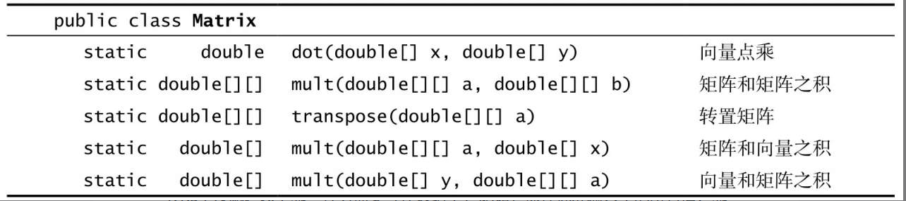
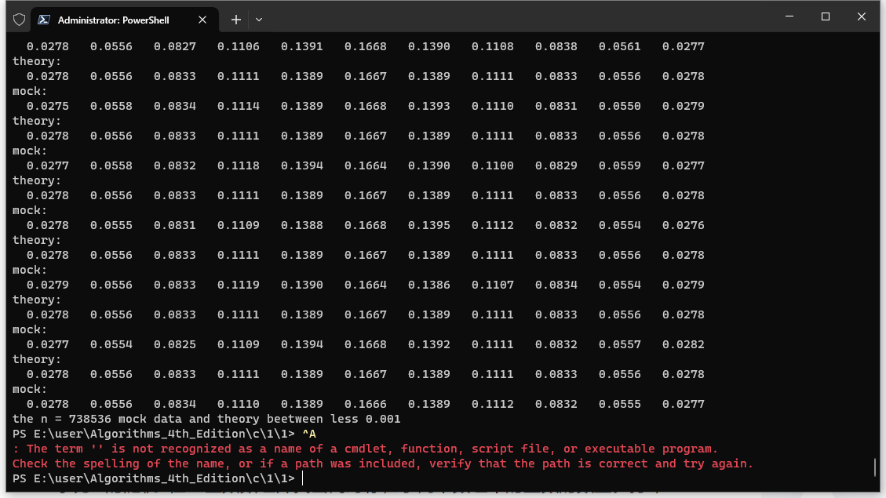

# 算法(第4版) 1.1基础编程模型练习题

## 1.1.1 给出以下表达式的值

```c
a. ( 0 + 15 ) / 2    //7
b. 2.0e-6 ＊ 100000000.1    //200000000.2e-6 
c. true && false || true && true    //1
```

## 1.1.2 给出以下表达式的类型和值

```c
a. (1 + 2.236)/2    //java - 1.618(double),c - 1.618(double)
b. 1 + 2 + 3 + 4.0    //java - 10.0(double),c - 10.0(double)
c. 4.1 ＞= 4    //java - true(bool),c - 1(int)
d. 1 + 2 + "3"    //java - "33"(String),c - error
```

## 1.1.3 编写一个程序，从命令行得到三个整数参数。如果它们都相等则打印equal，否则打印not equal

```c
#include <stdio.h>
#include <stdlib.h>

/*
 * 三个整数比较，如果它们都相等,返回1，否则返回0
 * 参数: a - int类型数据
 * 参数: b - int类型数据
 * 参数: c - int类型数据
 * 返回: 如果a,b,c都相等,返回1,否则返回0
 */
int threeCompar(int a,int b,int c);

int main(int argc,char * argv[])
{
    if(argc < 3)
    {
        fprintf(stderr,"Usage:%s integer1 integer2 integer3",argv[0]);
        exit(EXIT_FAILURE);
    }

    int a = atoi(argv[1]);
    int b = atoi(argv[2]);
    int c = atoi(argv[3]);
    
    if(threeCompar(a,b,c))
        puts("equal");
    else
        puts("not equal");

    return 0;
}


/*
 * 三个整数比较，如果它们都相等,返回1，否则返回0
 * 参数: a - int类型数据
 * 参数: b - int类型数据
 * 参数: c - int类型数据
 * 返回: 如果a,b,c都相等,返回1,否则返回0
 */
int threeCompar(int a,int b,int c)
{
    return a == b && b == c;
}

```

```java
public class Test1_1_3 {
    public static boolean threeCompar(int a, int b, int c)
    {
        return a == b && b == c;
    }
    public static void main(String[] args) {
        int a = Integer.parseInt(args[0]);
        int b = Integer.parseInt(args[1]);
        int c = Integer.parseInt(args[2]);

        if(threeCompar(a,b,c))
            System.out.println("equal");
        else
            System.out.println("not equal");
    }
}
```

## 1.1.4 下列语句各有什么问题（如果有的话

```c
a. if (a ＞ b) then c = 0;   //c-语法不需要then,java-同上
b. if a ＞ b { c = 0; }    //c-无问题,java-无问题
c. if (a ＞ b) c = 0;    //c-无问题,java-无问题
d. if (a ＞ b) c = 0 else b = 0;   //c-无问题,java-无问题
```

## 1.1.5 编写一段程序，如果double类型的变量x和y都严格位于0和1之间则打印true，否则打印false

```c
#include <stdio.h>

void judgexy(double x,double y);

void judgexy(double x,double y)
{
    if(x>=0 && x<=1 && y>=0 && y<=1)
        puts("true");
    else
        puts("false");
}
```

```java
public class Test1_1_5 {

    public static void judgexy(double x,double y) {
        if(x >= 0 && y >= 0 && x <= 1 && y <= 1)
            System.out.println("true");
        else
            System.out.println("false");
    }
}
```

## 1.1.6 下面这段程序会打印出什么

```java
int f = 0;
int g = 1;
for (int i = 0; i ＜= 15; i++)
{
    StdOut.println(f);
    f = f + g;
    g = f - g;
}
```

```java
0
1
1
2
3
5
8
13
21
34
55
89
144
233
377
610 
```

## 1.1.7 分别给出以下代码段打印出的值

```java
a. double t = 9.0;
  while (Math.abs(t -9.0/t) ＞ .001)
      t = (9.0/t + t) / 2.0;
  StdOut.printf("%.5f\n", t);
// 3.00009

b. int sum = 0;
  for (int i = 1; i ＜ 1000; i++)
      for (int j = 0; j ＜ i; j++)
          sum++;
  StdOut.println(sum);
// 499500

c. int sum = 0;
  for (int i = 1; i ＜ 1000; i ＊= 2)
      for (int j = 0; j ＜ 1000; j++)
          sum++;
  StdOut.println(sum);
// 10000
```

## 1.1.8 下列语句会打印出什么结果？给出解释

```java
a. System.out.println('b');    //b,打印b字符
b. System.out.println('b' + 'c');    //197,+运算会把char转换成int,再运算，b的ascii码是98,c的ascii码是99,所以相加等于197
c. System.out.println((char) ('a' + 4));    //一开始过程类似，得到整数101,跟着强制类型转换为char,对应就是e
```

## 1.1.9 编写一段代码，将一个正整数N用二进制表示并转换为一个String类型的值s

解答：Java有一个内置方法Integer.toBinaryString(N)专门完成这个任务，但该题的目的就是给出这个方法的其他实现方法。下面就是一个特别简洁的答案：

```java
String s = "";
for (int n = N; n ＞ 0; n /= 2)
    s = (n % 2) + s;
```

```c
#include <stdio.h>
#define BSIZE 100

char * itobitstr(char * bitstr,int bsize,int n);

int main(void)
{
    char bs[BSIZE];
    int n;
    while(scanf("%d",&n) == 1)
    {
        itobitstr(bs,BSIZE,n);
        printf("%d is %s\n",n,bs);
    }
    return 0;
}

char * itobitstr(char * bitstr,int bsize,int n)
{
    int top = 0;
    char temp;
    for(int i = n; i > 0; i /= 2)
    {
        bitstr[top] = '0' + i % 2;
        top++;
        if(top >= bsize)
            break;
    }
    bitstr[top] = '\0';
    for(int i = 0,j = top - 1; i < j; i++,j--)
    {
        temp = bitstr[i];
        bitstr[i] = bitstr[j];
        bitstr[j] = temp;
    }
    return bitstr;
}
```

## 1.1.10 下面这段代码有什么问题

```java
int[] a;
for (int i = 0; i ＜ 10; i++)
    a[i] = i ＊ i;
```

```c
在c里
使用未初始化的指针的结果是未知的

在java里:
解答：它没有用new为a[]分配内存。这段代码会产生一个variable a might not have been initialized的编译错误。
```

## 1.1.11 编写一段代码，打印出一个二维布尔数组的内容。其中，使用＊表示真，空格表示假。打印出行号和列号

```java
public class Test1_1_11 {

    public static void printfboolarray(boolean[][] arr)
    {
        for (int i = 0; i <arr.length; i++) {
            for (int j = 0; j < arr[i].length; j++) {
                System.out.printf("%d - %d : %c\n",i,j,arr[i][j] ? '*':' ');;
            }
        }
    }
}
```

```c
#include <stdio.h>
#include <stdlib.h>

#define ROW 10
#define COL 3

void printboolarr(int row,int col,int arr[row][col]);

int main(void)
{
    int arr[ROW][COL];
    for(int i = 0; i < ROW; i++)
        for(int j = 0; j < COL; j++)
            arr[i][j] = rand() % 2;
    printboolarr(ROW,COL,arr);
    return 0;
}

void printboolarr(int row,int col,int arr[row][col])
{
    for(int i = 0; i < row; i++)
        for(int j = 0; j < col; j++)
            printf("%d - %d : %c\n",i,j,arr[i][j] ? '*' : ' ');
}
```

## 1.1.12 以下代码段会打印出什么结果

```java
int[] a = new int[10];
for (int i = 0; i ＜ 10; i++)
    a[i] = 9- i;
for (int i = 0; i ＜ 10; i++)
    a[i] = a[a[i]];
for (int i = 0; i ＜ 10; i++)
    System.out.println(i);
```

```java
0
1
2
3
4
5
6
7
8
9
```

## 1.1.13 编写一段代码，打印出一个M行N列的二维数组的转置（交换行和列

```c
#include <stdio.h>

#define ROW 3
#define COL 9

void printreverse(int row,int col,int arr[row][col]);

int main(void)
{
    int arr[ROW][COL];

    for(int i = 0;i < ROW; i++)
        for(int j = 0; j < COL; j++)
            arr[i][j] = (i + 1) * 10 + j;

    printreverse(ROW,COL,arr);
    return 0;
}

void printreverse(int row,int col,int arr[row][col])
{
    for(int i = 0; i < col; i++)
    {
        for(int j = 0; j < row; j++)
            printf("%d ",arr[j][i]);
        putchar('\n');
    }
}

```

```java
public class Test1_1_13 {

    public static void printreverse(int[][] arr)
    {
        for (int i = 0; i < arr[0].length; i++) {
            for (int j = 0; j < arr.length; j++) {
                System.out.printf("%d ",arr[j][i]);
            }
        }
    }
}
```

## 1.1.14 编写一个静态方法lg()，接受一个整型参数N，返回不大于log2N的最大整数。不要使用Math库

```c
#include <stdio.h>
#include <stdlib.h>

int lg(double n);

int main(void)
{
    int result;
    double n;
    while(scanf("%lf",&n) == 1)
    {
        result = lg(n);
        printf("long2 %lf the biggest integer is %d\n",n,result);
    }
    return 0;
}

int lg(double n)
{
    int result = 0;
    if(n <= 0)
    {
        fprintf(stderr,"%d < 0,Not in the defined field of log\n");
        exit(EXIT_FAILURE);
    }

    if(n >= 1)
        for(int i = 2; i <= n; i *= 2)
            result++;
    else
    {
        result = -1;
        for(double i = 1.0 / 2.0; i > n; i /= 2.0)
            result--;
    }
    return result;
}
```

```java
public class Test1_1_14 {
    public static int lg(int n)
    {
        if(n <= 0)
            throw new IllegalArgumentException("lg的参数要大于0,当前参数:" + n);
        int result =1;
        for (int i = 2; i < n; i *= 2)
            result++;
        return result;
    }
}
```

## 1.1.15 编写一个静态方法histogram()，接受一个整型数组a[]和一个整数M为参数并返回一个大小为M的数组，其中第i个元素的值为整数i在参数数组中出现的次数。如果a[]中的值均在0到M-1之间，返回数组中所有元素之和应该和a.length相等

```c
#include <stdio.h>
#include <stdlib.h>
#define SIZE 10

int * histogram(int a[],int asize,int m);

int main(void)
{
    int a[SIZE] = {1,2,3,4,5,6,7,8,9,11};
    int * result;
    result = histogram(a,SIZE,SIZE + 1);

    for(int i = 0; i < SIZE + 1; i++)
        printf("%d ",result[i]);
    free(result);
    return 0;
}

int * histogram(int a[],int asize,int m)
{
    int * result;
    result = calloc(m,sizeof(int));
    for(int i = 0; i < asize; i++)
        if(a[i] >= 0 && a[i] < m)
            result[a[i]]++;
    return result;
}
```

```java
public class Test1_1_15 {
    public static int [] histogram(int a[],int m)
    {
        int[] result = new int[m];
        for (int i = 0; i < a.length; i++)
            if(a[i] >= 0 && a[i] < m)
                result[a[i]]++;
        return result;
    }
}
```

## 1.1.16 给出exR1(6)的返回值

```java
public static String exR1(int n)
{
    if (n ＜= 0) return "";
    return exR1(n-3) + n + exR1(n-2) + n;
}
//311361142246
6 exr1(3) + 6 + exr1(4) + 6;
3 exr1(0) + 3 + exr1(1) + 3;
4 exr1(1) + 4 + exr1(2) + 4;
1 exr1(-2) + 1 + exr1(-1) + 1;
2 exr1(-1) + 2 + exr1(0) + 2;
```

## 1.1.17 找出以下递归函数的问题

```java
public static String exR2(int n)
{
    String s = exR2(n-3) + n + exR2(n-2) + n;
    if (n ＜= 0) return "";
    return s;
}
```

答：这段代码中的基础情况永远不会被访问。调用exR2(3)会产生调用exR2(0)、exR2(-3)和exR2(-6)，循环往复直到发生StackOverflowError。

## 1.1.18 请看以下递归函数

```java
public static int mystery(int a, int b)
{
    if (b == 0)      return 0;
    if (b % 2 == 0) return mystery(a+a, b/2);
    return mystery(a+a, b/2) + a;
}
```

- mystery(2, 25)和mystery(3, 11)的返回值是多少？
  - mystery(2,25) = 50,mystery(3,11) = 33
- 给定正整数a和b, mystery(a,b)计算的结果是什么？
  - mystery(a,b) = a * b;
- 将代码中的+替换为＊并将return 0改为return 1，然后回答相同的问题。
  - mystery(2,25) = 33554432,mystery(3,11) = 177147
  - mystery(a,b) = a 的 b 次方;

## 1.1.19 在计算机上运行以下程序

```java
public class Fibonacci
{
    public static long F(int N)
    {
      if (N == 0) return 0;
      if (N == 1) return 1;
      return F(N-1) + F(N-2);
    }
    public static void main(String[] args)
    {
      for (int N = 0; N ＜ 100; N++)
          StdOut.println(N + " " + F(N));
    }
}
```

计算机用这段程序在一个小时之内能够得到F(N)结果的最大N值是多少？开发F(N)的一个更好的实现，用数组保存已经计算过的值。

- 一个小时内能够最大N值是56

```java
import edu.princeton.cs.algs4.StdOut;
import java.math.BigInteger;
import java.util.Objects;

public class Fibonacci
{
    public static BigInteger[] fb = new BigInteger[1000];
    public static BigInteger F(int N)
    {
        if (N == 0) return new BigInteger("0");
        if (N == 1) return new BigInteger("1");
        if(Objects.nonNull(fb[N])) return fb[N];
        fb[N] = F(N-1).add(F(N-2));
        return fb[N];
    }
    public static void main(String[] args)
    {
        for (int i = 0; i < 100; i++)
            StdOut.println(i + " " + F(i));
    }
}
```

```c
#include <stdio.h>
#define SIZE 1000

static long fb[1000]; 

long F(int N);

int main(void)
{
    for(int i = 0; i < 100; i++)
        printf("%d %ld\n",i,F(i));
    return 0;
}

long F(int N)
{
    if(N == 0) return 0;
    if(N == 1) return 1;
    if(fb[N] !=0) return fb[N];
    fb[N] = F(N-1) + F(N-2);
    return fb[N];
}
```

## 1.1.20 编写一个递归的静态方法计算ln(N! )的值

```c
#include <stdio.h>
#include <math.h>

double lnN(int n);

int main(void)
{
    for(int i = 1; i < 100; i++)
        printf("%d %lf\n",i,lnN(i));
    return 0;
}

double lnN(int n)
{
    if(n == 1) return log((double) 1);
    return log((double)n) + lnN(n - 1);
}
```

```java
public class Test1_1_20 {

    public static double lnN(int n)
    {
        if(n == 1) return Math.log((double) 1);
        return Math.log((double) n) + lnN(n-1);
    }

    public static void main(String[] args) {
        for (int i = 1; i < 100; i++) {
            System.out.println(i + " " + lnN(i));
        }
    }
}
```

## 1.1.21 编写一段程序，从标准输入按行读取数据，其中每行都包含一个名字和两个整数。然后用printf()打印一张表格，每行的若干列数据包括名字、两个整数和第一个整数除以第二个整数的结果，精确到小数点后三位。可以用这种程序将棒球球手的击球命中率或者学生的考试分数制成表格

```c
#include <stdio.h>
#define LEN 20

int main(void)
{
    char name[LEN];
    int a,b;
    while(scanf("%s%d%d",name,&a,&b) == 3)
        printf("%-20s %-10d %-10d %-10.3lf\n",name,a,b,(double) a / b);
    return 0;
}
```

```java
import edu.princeton.cs.algs4.StdIn;
import edu.princeton.cs.algs4.StdOut;

public class Test1_1_21 {
    public static void main(String[] args) {
        String name;
        int a,b;
        while(!StdIn.isEmpty())
        {
            name = StdIn.readString();
            a = StdIn.readInt();
            b = StdIn.readInt();
            StdOut.printf("%-20s %-10d %-10d %10.3f\n",name,a,b,(double) a / b);
        }
    }
}
```

## 1.1.22 使用1.1.6.4节中的rank()递归方法重新实现BinarySearch并跟踪该方法的调用。每当该方法被调用时，打印出它的参数lo和hi并按照递归的深度缩进。提示：为递归方法添加一个参数来保存递归的深度

```c
#include <stdio.h>
#define SIZE 100

int rank(int key, int a[], int lo, int hi, int deep);

int main(void)
{
    int a[SIZE];
    int key;
    for(int i = 0; i < SIZE; i++)
        a[i] = i;
    while(scanf("%d",&key) == 1)
        rank(key,a,0,SIZE - 1,0);
    return 0;
}

int rank(int key, int a[], int lo, int hi, int deep)
{
    printf("lo = %d, hi = %d, deep = %d\n", lo, hi, deep);
    int mid;
    if( lo > hi ) return -1;
    mid = lo + (hi - lo) / 2;
    if(key < a[mid]) return rank(key, a, lo, mid - 1,deep + 1);
    else if(key > a[mid]) return rank(key, a, mid + 1, hi,deep + 1);
    else return mid;
}
```

```java
public class Test1_1_22 {
    public static int rank(int key,int[] a)
    {
        return rank(key,a,0,a.length - 1,0);
    }

    public static int rank(int key,int[] a,int lo,int hi,int deep)
    {
        System.out.printf("lo = %d, hi = %d, deep = %d\n",lo,hi,deep);
        if(lo > hi) return -1;
        int mid = (lo + hi) / 2;
        if(a[mid] > key) return rank(key,a,lo,mid - 1,deep + 1);
        else if(a[mid] < key) return rank(key,a,mid + 1,hi,deep + 1);
        else return  mid;
    }
}
```

## 1.1.23 为BinarySearch的测试用例添加一个参数：+打印出标准输入中不在白名单上的值；-，则打印出标准输入中在白名单上的值

```c
#include <stdio.h>
#include <stdlib.h>
#include "..\..\lib\in.h"

int rank(int key, int * a,int length);
int intcompar(const void * a,const void *b);

int main(int argc,char * argv[])
{
    if(argc < 3)
    {
        fprintf(stderr,"Usage:%s filename op(+ or -)",argv[0]);
        exit(EXIT_FAILURE);
    }
    if(!(argv[2][0] == '+' || argv[2][0] == '-'))
    {
        fprintf(stderr,"Usage:%s filename op(+ or -),the op is not + or -,now op is %s",argv[0],argv[2]);
        exit(EXIT_FAILURE);
    }
    int key;
    int_arr whitelist;
    readInts(&whitelist,argv[1]);
    qsort(whitelist.data,whitelist.length,sizeof(int),intcompar);

    while(scanf("%d",&key) == 1)
    {
        if(argv[2][0] == '+')
        {
            if(rank(key,whitelist.data,whitelist.length) < 0)
                printf("%d\n",key);
        } else {
            if(rank(key,whitelist.data,whitelist.length) >= 0)
                printf("%d\n",key);
        }
    }
    free(whitelist.data);
    return 0;
}

int rank(int key, int * a,int length)
{
    int lo = 0;
    int hi = length -1;
    while(lo <= hi)
    {
        int mid = lo + (hi - lo) / 2;
        if(key < a[mid]) hi = mid - 1;
        else if (key > a[mid]) lo = mid + 1;
        else return mid;
    }
    return -1;
}

int intcompar(const void * a,const void * b)
{
    int * ia = (int *) a;
    int * ib = (int *) b;
    return *ia - *ib;
}

```

```java
import edu.princeton.cs.algs4.In;
import edu.princeton.cs.algs4.StdIn;
import edu.princeton.cs.algs4.StdOut;

import java.util.Arrays;

public class Test1_1_23 {
        public static int rank(int key, int[] a)
        {  // 数组必须是有序的
            int lo  = 0;
            int hi = a.length -1;
            while (lo <= hi)
            {  // 被查找的键要么不存在，要么必然存在于a[lo..hi]之中
                int mid = lo + (hi - lo) / 2;
                if       (key < a[mid]) hi = mid -1;
          else if (key > a[mid]) lo = mid + 1;
          else                     return mid;
            }
            return -1;
        }
        public static void main(String[] args)
        {
            int[] whitelist = In.readInts(args[0]);
            Arrays.sort(whitelist);
            char op = args[1].charAt(0);
            while (! StdIn.isEmpty())
            {  // 读取键值，如果不存在于白名单中则将其打印
                int key = StdIn.readInt();
                if(op == '-') {
                    if (rank(key, whitelist) >= 0)
                        StdOut.println(key);
                } else
                    if (rank(key, whitelist) >= 0)
                        StdOut.println(key);
            }
        }
}
```

## 1.1.24 给出使用欧几里得算法计算105和24的最大公约数的过程中得到的一系列p和q的值。扩展该算法中的代码得到一个程序Euclid，从命令行接受两个参数，计算它们的最大公约数并打印出每次调用递归方法时的两个参数。使用你的程序计算1111111和1234567的最大公约数

```c
#include <stdio.h>
#include <stdlib.h>

int gcd(int p, int q);

int main(int argc,char *argv [])
{
    int p,q,result;
    if(argc < 3)
    {
        fprintf(stderr,"Usage: %s integer1 interger2\n",argv[0]);
        exit(EXIT_FAILURE);
    }
    
    p = atoi(argv[1]);
    q = atoi(argv[2]);
    result = gcd(p,q);
    printf("The greatest common divisor of %d and %d is %d",p,q,result);
    return 0;
}

int gcd(int p, int q)
{
    printf("p = %d, q = %d\n",p,q);
    if(q == 0) return p;
    int r = p % q;
    return gcd(q, r);
}
```

```java
public class Euclid {

    public static int gcd(int p,int q)
    {
        System.out.printf("p = %d, q = %d\n",p,q);
        if(q == 0) return p;
        int r = p % q;
        return gcd(q,r);
    }

    public static void main(String[] args) {
        if(args.length < 2)
            throw new IllegalArgumentException("参数数量不对:");
        int p = Integer.parseInt(args[0]);
        int q = Integer.parseInt(args[1]);
        System.out.printf("p = %d, q = %d,result = %d\n",p,q,gcd(p,q));
    }
}
```

## 1.1.25 使用数学归纳法证明欧几里得算法能够计算任意一对非负整数p和q的最大公约数

**基本情况:** 当q等于0时，根据欧几里得算法，最大公约数为p。这是基本情况下的成立条件。

**归纳假设:** 假设当q小于某个正整数k时，欧几里得算法能够正确计算p和q的最大公约数。

**归纳步骤:** 我们需要证明当q等于k时，欧几里得算法也能够正确计算p和q的最大公约数。

根据欧几里得算法，我们将p除以q得到商q'和余数r（p=qq'+r），其中r小于q。因为r=q-1q'，所以r也是q的因数。因此，任意整数能够整除p和q的数，也能够整除q和r。

假设d是p和q的最大公约数，那么d也是q和r的公约数。因为d是p和q的最大公约数，所以任何其他的公约数都不能大于d。对于q和r，任何能够整除q和r的数也能够整除p和q，因此任何小于d的数也不能是q和r的公约数。所以，d是q和r的最大公约数。

根据归纳假设和归纳步骤，我们可以得出结论：欧几里得算法能够计算任意一对非负整数p和q的最大公约数。

欧几里得算法的原理是 GCD递归定理

GCD递归定理：

对任意 非负整数 a 和 任意 整数 b，gcd(a,b) = gcd(b, a mod b)
为了证明这个定理，我们首先需要知道一下几个有关 gcd 的基本知识跟相关等式跟推论

1.1 基本知识：

公约数

定义：如果 d|a（d 整除 a）且 d|b，那么 d 是 a 与 b 的 公约数。

性质：如果 d|a 且 d|b，那么 d|(ax + by); x,y ∈ Z(任意整数)

最大公约数

定义：两个非零整数 a 和 b 的公约数里最大的就是 最大公约数。

1.2 相关等式跟推论：

等式 1：如果 a|b 且 b|a 那么 a = ±b

等式 2：如果 d|a 且 d|b 那么 d|(ax + by); x,y ∈ Z

等式 3：a mod n = a - n⌊a/n⌋(向下整除); a∈Z,n∈N*(正整数)

推论 1：对任意整数 a , b，如果 d|a 且 d|b 则 d|gcd(a, b)

二、证明过程

如果我们想要获得结论gcd(a,b) = gcd(b, a mod b)

那么我们只需要证明gcd(a,b)|gcd(b, a mod b) 且 gcd(b,a mod b)|gcd(a,b)就可以利用等式 1来证明他俩相等了。

2.1 证明 gcd(a,b)|gcd(b,a mod b)

设 d = gcd(a, b)

∴ d|a 且 d|b

∵ 由 等式 3 可知：(a mod b) = a - qb q = ⌊a/b⌋

∴ a mod b 是 a 与 b 的线性组合

∴ 由 等式 2 可知 ：d|(a mod b)

∵ d|b 且 d|(a mod b)

∴ 由 推论 1 可知 d|gcd(b, a mod b)

等价结论： gcd(a, b)|gcd(b, a mod b)

2.2 证明 gcd(b,a mod b)|gcd(a,b)

设 c = gcd(b, a mod b)

∴ c|b 且 c|(a mod b)

∵ a = qb + r

​ r = a mod b

​ q = ⌊a/b⌋

∴ a 是 b 和 (a mod b) 的线性组合

∴ 由 等式 2 可知：c|a

∵ c|a 且 c|b

∴ 由 推论 1 可知：c|gcd(a, b)

等价结论： gcd(b, a mod b)|gcd(a, b)s

2.3 证明 gcd(a,b) = gcd(b, a mod b)

由 上述两个结论 可知：

gcd(a, b)|gcd(b, a mod b)

gcd(b, a mod b)|gcd(a, b)

∴ 由 等式 1 可知：

​ gcd(a, b) = gcd(b, a mod b)

到这里 GCD递归定理 就证明结束了

## 1.1.26 将三个数字排序。假设a、b、c和t都是同一种原始数字类型的变量。证明以下代码能够将a、b、c按照升序排列

```c
if (a ＞ b) { t = a; a = b; b = t; }
if (a ＞ c) { t = a; a = c; c = t; }
if (b ＞ c) { t = b; b = c; c = t; }
```

由以上代码可以得到,a <= b,a <= c,b <= c,所以a<=b<=c.所以a,b,c按照升序排列

## 1.1.27 二项分布。估计用以下代码计算binomial(100, 50, 0.25)将会产生的递归调用次数

```java
public static double binomial(int N, int k, double p)
{
    if (N == 0 && k == 0) return 1.0;
    if (N ＜ 0 || k ＜ 0) return 0.0;
    return (1.0- p)＊binomial(N-1, k, p) + p＊binomial(N-1, k-1, p);
}
```

将已经计算过的值保存在数组中并给出一个更好的实现。

```c
#include <stdio.h>

double blarr[200][200] = {0.0};

double binomial(int n, int k, double p);
double binomial1(int n, int k, double p);

int main(void)
{
    double result,p;
    int n,k;
    while(scanf("%d%d%lf",&n,&k,&p) == 3)
    {
        result = binomial(n, k, p);
        printf("binomial(%d, %d, %lf) = %lf\n",n,k,p,result);
        result = binomial1(n, k, p);
        printf("binomial1(%d, %d, %lf) = %lf\n",n,k,p,result);
    }
    return 0;
}

double binomial(int n, int k, double p)
{
    if(n == 0 && k == 0) return 1.0;
    if(n < 0 || k < 0) return 0.0;
    if(blarr[n + 1][k + 1] != 0.0) return blarr[n + 1][k + 1] - 1;
    blarr[n + 1][k + 1] = (1.0 - p) * binomial(n - 1,k,p) + p * binomial(n - 1, k - 1, p) + 1;
    return blarr[n + 1][k + 1] - 1;
}

double binomial1(int n, int k, double p)
{
    if(n == 0 && k == 0) return 1.0;
    if(n < 0 || k < 0) return 0.0;
    return (1.0 - p) * binomial(n - 1,k,p) + p * binomial(n - 1, k - 1, p);
 
}
```

## 1.1.28 删除重复元素。修改BinarySearch类中的测试用例来删去排序之后白名单中的所有重复元素

```c
#include <stdio.h>
#include <stdlib.h>
#include "..\..\lib\in.h"

int rank(int key, int * a,int length);
int intcompar(const void * a,const void *b);
int rmduplicate(int * a,int length);

int main(int argc,char * argv[])
{
    int key;
    int_arr whitelist;
    readInts(&whitelist,argv[1]);
    qsort(whitelist.data,whitelist.length,sizeof(int),intcompar);
    whitelist.length = rmduplicate(whitelist.data,whitelist.length);
    while(scanf("%d",&key) == 1)
    {
        if(rank(key,whitelist.data,whitelist.length) < 0)
            printf("%d\n",key);
    }
    free(whitelist.data);
    return 0;
}

int rank(int key, int * a,int length)
{
    int lo = 0;
    int hi = length -1;
    while(lo <= hi)
    {
        int mid = lo + (hi - lo) / 2;
        if(key < a[mid]) hi = mid - 1;
        else if (key > a[mid]) lo = mid + 1;
        else return mid;
    }
    return -1;
}

int intcompar(const void * a,const void * b)
{
    int * ia = (int *) a;
    int * ib = (int *) b;
    return *ia - *ib;
}

int rmduplicate(int * a,int length)
{
    if( length == 0 || length == 1)
        return length;

    int newcount = 0;
    int old = 0;
    for(int i = 1; i < length; i++)
    {
        if(a[old] != a[i])
            old++;
        a[old] = a[i];
    }
    return old + 1;
}
```

```java
import edu.princeton.cs.algs4.In;
import edu.princeton.cs.algs4.StdIn;
import edu.princeton.cs.algs4.StdOut;

import java.util.Arrays;

public class Test1_1_28 {
    public static int rank(int key, int[] a)
    {  // 数组必须是有序的
        int lo  = 0;
        int hi = a.length -1;
        while (lo <= hi)
        {  // 被查找的键要么不存在，要么必然存在于a[lo..hi]之中
            int mid = lo + (hi - lo) / 2;
            if       (key < a[mid]) hi = mid -1;
            else if (key > a[mid]) lo = mid + 1;
            else                     return mid;
        }
        return -1;
    }

    public static int[] rmduplicate(int[] a)
    {
        if(a.length == 0 || a.length == 1)
            return a;

        int old = 0;
        for(int i = 1; i < a.length; i++)
        {
            if(a[old] != a[i])
                old++;
            a[old] = a[i];
        }
        old++;
        int[] na = new int[old];
        System.arraycopy(a, 0, na, 0, old);
        return na;
    }

    public static void main(String[] args)
    {
        int[] whitelist = In.readInts(args[0]);
        Arrays.sort(whitelist);
        char op = args[1].charAt(0);
        while (! StdIn.isEmpty())
        {  // 读取键值，如果不存在于白名单中则将其打印
            int key = StdIn.readInt();
            if(op == '-') {
                if (rank(key, whitelist) >= 0)
                    StdOut.println(key);
            } else
            if (rank(key, whitelist) >= 0)
                StdOut.println(key);
        }
    }
}
```

## 1.1.29 等值键。为BinarySearch类添加一个静态方法rank()，它接受一个键和一个整型有序数组（可能存在重复键）作为参数并返回数组中小于该键的元素数量，以及一个类似的方法count()来返回数组中等于该键的元素的数量。注意：如果i和j分别是rank(key, a)和count(key, a)的返回值，那么a[i..i+j-1]就是数组中所有和key相等的元素

```c
#include <stdio.h>
#include <stdlib.h>
#include "..\..\lib\in.h"

int rank(int key,const int * a,int length);
int rankmin(int key, int * a,int length);
int intcompar(const void * a,const void *b);
int count(int key, const int * a,int length);
void printarr(const int * a, int n);

int main(int argc,char * argv[])
{
    int key;
    int i,j;
    int_arr whitelist;
    readInts(&whitelist,argv[1]);
    qsort(whitelist.data,whitelist.length,sizeof(int),intcompar);
    printarr(whitelist.data,whitelist.length);
    while(scanf("%d",&key) == 1)
    {
        i = rankmin(key,whitelist.data,whitelist.length);
        j = count(key,whitelist.data,whitelist.length);
        printf("i = %d, j = %d\n", i, j);
    }
    free(whitelist.data);
    return 0;
}

int rank(int key,const int * a,int length)
{
    int lo = 0;
    int hi = length -1;
    while(lo <= hi)
    {
        int mid = lo + (hi - lo) / 2;
        if(key < a[mid]) hi = mid - 1;
        else if (key > a[mid]) lo = mid + 1;
        else return mid;
    }
    return -1;
}

int intcompar(const void * a,const void * b)
{
    int * ia = (int *) a;
    int * ib = (int *) b;
    return *ia - *ib;
}

/*
 * 在长度为length的有序数组a中找到比key小的元素个数
 * 参数: key - int类型的要查找比较的数
 * 参数: a - 有序的数组a
 * 参数: length - 数组长度
 * return: 返回比key小的元素个数 
 */
int rankmin(int key, int * a,int length)
{
    int mid;
    // 二分查找到的位置
    mid = rank(key,a,length);
    while(0 < mid)
    {
        if(a[mid] != a[mid - 1])
            break;
        mid--;
    }
    return mid;
}

int count(int key, const int * a,int length)
{
    int cnt = 1;
    int mid;
    mid = rank(key,a,length);
    if(mid == -1)
        return -1;
    //向前统计
    for(int i = mid; i > 0 && a[i] == a[i - 1]; i--)
        cnt++;
    //向后统计
    for(int i = mid; i < length - 1 && a[i] == a[i + 1]; i++)
        cnt++;
    return cnt;
}

void printarr(const int * a, int n)
{
    for(int i = 0; i < n; i++)
        printf("%d%c",a[i], (i + 1) % 5 ? ' ':'\n');
    putchar('\n');
}
```

```java
public class Test1_1_29 {
    public static int rank(int key, int[] a,int lo,int hi)
    {  // 数组必须是有序的
        if(lo > hi) return -1;
        int mid = lo + (hi - lo)/2;
        if(key < a[mid]) return rank(key,a,lo,mid - 1);
        else if(key > a[mid]) return rank(key,a,mid + 1,hi);
        else return mid;
    }

    public static int rank(int key,int[] a)
    {
        int mid = rank(key,a,0,a.length - 1);
        for (; mid > 0 && a[mid] == a[mid - 1]; mid--)
            continue;
        return mid;
    }

    public static int count(int key,int[] a)
    {
        int mid = rank(key,a,0,a.length - 1);
        if(mid == -1)
            return -1;
        int cnt = 1;
        for (int i = mid; i > 0 && a[mid] == a[mid - 1] ; i--)
            cnt++;
        for (int i = mid; i < a.length - 1 && a[mid] == a[mid + 1] ; i++)
            cnt++;
        return cnt;
    }
}
```

## 1.1.30 数组练习。编写一段程序，创建一个N×N的布尔数组a[][]。其中当i和j互质时（没有相同因子）, a[i] [j]为true，否则为false

```c
#include <stdio.h>
#include <stdlib.h>
#include <stdbool.h>

/*
 * 创建一个n * n的布尔数组a[][].其中当i和j互质时,a[i][j]为true,否则为false.
 * 参数: n - 二维数组行列大小
 * 返回: 返回二维数组的指针.ps:使用注意free创建的内存
 */
bool ** boolarr(int n);

int gcd(int p, int q);

void freearr(int n,bool ** arr);

int main(void)
{
    bool ** arr;
    int n;
    while(scanf("%d",&n)==1)
    {
        arr = boolarr(n);
        for(int i = 0; i < n; i++)
        {
            for(int j = 0; j < n; j++)
                printf("%5s ", arr[i][j] ? "true" : "false");
            putchar('\n');
        }
        putchar('\n');
        freearr(n,arr);
    }
    return 0;
}

/*
 * 创建一个n * n的布尔数组a[][].其中当i和j互质时,a[i][j]为true,否则为false.
 * 参数: n - 二维数组行列大小
 * 返回: 返回二维数组的指针.ps:使用注意最后要free()创建的内存
 */
bool ** boolarr(int n)
{
    bool ** arr;
    arr = (bool **) malloc(n * sizeof(bool *));
    if(arr == NULL)
    {
        fprintf(stderr,"Create the n * n arr failure");
        exit(EXIT_FAILURE);
    }
    for(int i = 0; i < n; i++)
        arr[i] = (bool *) malloc(n * sizeof(bool));

    for(int i = 0; i < n; i++)
        for(int j = 0; j < n;j++)
            if(gcd(i,j) == 1)
                arr[i][j] = true;
            else
                arr[i][j] = false;
    return arr;
}

int gcd(int p, int q)
{
    if(q == 0) return p;
    int r = p % q;
    return gcd(q,r);
}

void freearr(int n,bool ** arr)
{
    for(int i = 0;i < n;i++)
        free(arr[i]);
    free(arr);
}
```

```java
public class Test1_1_30 {

    public static int gcd(int p,int q)
    {
        if(q == 0) return p;
        int r = p % q;
        return gcd(q,r);
    }
    public static boolean[][] boolarr(int n)
    {
        boolean[][] arr = new boolean[n][n];
        for (int i = 0; i < n; i++)
            for (int j = 0; j < n; j++)
                if(gcd(i,j) == 1)
                    arr[i][j] = true;
                else
                    arr[i][j] = false;
        return arr;
    }
}

```

## 1.1.31 随机连接。编写一段程序，从命令行接受一个整数N和double值p（0到1之间）作为参数，在一个圆上画出大小为0.05且间距相等的N个点，然后将每对点按照概率p用灰线连接

```c
\\ todo
```

```java
import edu.princeton.cs.algs4.StdDraw;
import edu.princeton.cs.algs4.StdRandom;

public class Test1_1_31 {

    public static void main(String[] args) {
        // 初始化画布
        StdDraw.setXscale(-5.0,5.0);
        StdDraw.setYscale(-5.0,5.0);
        drawCircle();
        int n = Integer.parseInt(args[0]);
        double p = Double.parseDouble(args[1]);

        Coordinate[] arr = getCirclePoint(0,0,4,n);
        StdDraw.setPenColor(StdDraw.BLACK);
        StdDraw.setPenRadius(0.05);
        for (int i = 0; i < n; i++) {
            StdDraw.point(arr[i].getX(),arr[i].getY());
        }

        StdDraw.setPenRadius();
        StdDraw.setPenColor(StdDraw.GRAY);
        StdRandom.setSeed(System.currentTimeMillis());
        for (int i = 0; i < n - 1; i++)
            for (int j = i + 1; j < n; j++) {
                if(StdRandom.uniformDouble() < p)
                    StdDraw.line(arr[i].getX(),arr[i].getY(),arr[j].getX(),arr[j].getY());
            }
    }

    /**
     * 计算得到圆上n个等距点的坐标
     * @param x 圆心的x坐标
     * @param y 圆心的y坐标
     * @param r 圆的半径
     * @param n 圆上等距点数量
     * @return 返回n个等距点坐标数组
     */
    public static Coordinate [] getCirclePoint(double x,double y,double r,int n)
    {
        Coordinate[] arr = new Coordinate[n];
        for (int i = 0; i < n; i++) {
            arr[i] = new Coordinate(x + r * Math.cos(2 * Math.PI / n * i),y + r * Math.sin(2 * Math.PI / n * i));
        }
        return arr;
    }
    public static void drawCircle()
    {
        StdDraw.setPenColor(StdDraw.BLUE);
        StdDraw.circle(0.0,0.0,4.0);
    }

    static class Coordinate
    {
        private double x;
        private double y;

        public Coordinate() {
            this(0,0);
        }

        public Coordinate(double x) {
            this(x,0);
        }

        public Coordinate(double x, double y) {
            this.x = x;
            this.y = y;
        }

        public double getX() {
            return x;
        }

        public void setX(double x) {
            this.x = x;
        }

        public double getY() {
            return y;
        }

        public void setY(double y) {
            this.y = y;
        }
    }
}
```

## 1.1.32 直方图。假设标准输入流中含有一系列double值。编写一段程序，从命令行接受一个整数N和两个double值l和r。将（l, r）分为N段并使用StdDraw画出输入流中的值落入每段的数量的直方图

```c
// todo
```

```java
import edu.princeton.cs.algs4.StdDraw;
import edu.princeton.cs.algs4.StdIn;

public class Test1_1_32 {

    public static void main(String[] args) {
        int n = Integer.parseInt(args[0]);
        double l = Double.parseDouble(args[1]);
        double r = Double.parseDouble(args[2]);
        if(l > r)
            throw new IllegalArgumentException("the argument is not right: " + l +" > " + r);

        int[] stats = new int[n];
        int max = 0;
        while(!StdIn.isEmpty())
        {
            double num = StdIn.readDouble();
            if(num < l || num >= r)
                continue;
            int index = (int) ( (num - l) / (r - l) * n );
            System.out.printf("num = %f, index = %d\n", num, index);
            stats[index]++;
            if(stats[index] > max)
                max = stats[index];
        }

        StdDraw.setXscale(0.0,1.0);
        StdDraw.setYscale(0.0,max + 1);
        for (int i = 0; i < n; i++) {
            double x = 1.0 * (i + 1) / ( n + 1);
            double y = stats[i] / 2.0;
            double rw =  0.5 / n / 2;
            double rh = stats[i] / 2.0;
            StdDraw.filledRectangle(x,y,rw,rh);
        }
    }
}

```

## 1.1.33 矩阵库。编写一个Matrix库并实现以下API



编写一个测试用例，从标准输入读取矩阵并测试所有方法。

```c
#include <stdio.h>
#include <stdlib.h>
#include "matrix.h"

/**
 * 向量点乘
 * param x[] 向量x数组,x与y长度必须相等
 * param y[] 向量x数组,x与y长度必须相等
 * param n 向量x与y的长度
 * return 返回矢量x和矢量y的內积
 */
double dot(double x[],double y[],int n)
{
    double result = 0.0;
    for(int i = 0; i < n; i++)
        result += x[i] * y[i];
    return result;
}

/**
 * 矩阵和矩阵之积
 * param arow 矩阵a的行数
 * param acol 矩阵a的列数
 * param a arow行,acol列的二维数组(代表矩阵)
 * param brow 矩阵b的行数
 * param bcol 矩阵b的列数
 * param b brow行,bcol列的二维数组(代表矩阵)
 * param result 提供存放结果的二维数组(代表矩阵),行等于arow,列等于bcol
 */
void mult(int arow,int acol,const double a[arow][acol],int brow,int bcol,const double b[brow][bcol],double result[arow][bcol])
{
    if(arow != bcol)
    {
        fprintf(stderr,"arow要等于brow,%d != %d",arow,bcol);
        exit(EXIT_FAILURE);
    }

    for(int i = 0; i < arow; i++)
        for(int j = 0; j < bcol; j++)
        {
            result[i][j] = 0.0;
            for(int k = 0; k < acol; k++)
                result[i][j] += a[i][k] * b[k][j];
        }
}

/**
 * 转置矩阵
 * param arow 矩阵a的行数
 * param acol 矩阵a的列数
 * param a 要转置的矩阵a
 * param result 提供存放结果的二维数组(代表矩阵),行等于acol,列等于brow
 */
void transpose(int arow,int acol,const double a[arow][acol],double result[acol][arow])
{
    for(int i = 0; i < acol; i++)
        for(int j = 0; j < arow; j++)
            result[i][j] = a[j][i];
}

/**
 * 矩阵和向量之积
 * param arow 矩阵a的行数
 * param acol 矩阵a的列数
 * param a 矩阵a
 * param x 向量x,长度等于a的行数acol
 * param result 存放结果的向量,长度为arow;
 * return 返回指向相乘后结果一维数组的指针
 */
double * matr_vect_mult(int arow,int acol,const double a[arow][acol],const double * x,double * result)
{
    for(int i = 0; i < arow;i++)
    {
        result[i] = 0.0;
        for(int j = 0; j < acol; j++)
            result[i] += a[i][j] * x[j];
    }
    return result;
}

/**
 * 向量和矩阵之积
 * param arow 矩阵a的行数
 * param acol 矩阵a的列数
 * param y 向量y,长度等于a的列数acol
 * param a 矩阵a
 * param result 存放结果的向量,长度为acol;
 * return 返回指向相乘后结果一维数组的指针
 */
double * vect_matr_mult(int arow,int acol,const double * y,const double a[arow][acol],double * result)
{
    for(int i = 0; i < acol; i++)
    {
        result[i] = 0.0;
        for(int j = 0; j < arow; j++)
            result[i] += y[j] * a[j][i];
    }
    return result;
}

int main(void)
{
    double x[10] = { 1, 2, 3, 4, 5, 6, 7, 8, 9, 10};
    double y[10] = { 1, 2, 3, 4, 5, 6, 7, 8, 9, 10};
    //测试x与y点乘
    double r1;
    r1 = dot(x,y,10);
    printf("r1 = %lf\n\n",r1);

    //测试a,b之积
    double a[3][10] = {
        { 1, 2, 3, 4, 5, 6, 7, 8, 9, 10},
        { 21, 22, 23, 24, 25, 26, 27, 28, 29, 210},
        { 31, 32, 33, 34, 35, 36, 37, 38, 39, 310}
    };
    double b[10][3] = {
        { 11, 21, 31 },
        { 12, 22, 32 },
        { 13, 23, 33 },
        { 14, 24, 34 },
        { 15, 25, 35 },
        { 16, 26, 36 },
        { 17, 27, 37 },
        { 18, 28, 38 },
        { 19, 29, 39 },
        { 10, 20, 30 }
    };
    double r2[3][3];
    mult(3,10,a,10,3,b,r2);
    for(int i = 0; i < 3;i++)
    {
        for(int j = 0; j < 3;j++)
            printf("%lf ",r2[i][j]);
        putchar('\n');
    }
    putchar('\n');

    //测试矩阵转置
    double r3[3][10];
    transpose(10,3,b,r3);
    for(int i = 0; i < 3;i++)
    {
        for(int j = 0; j < 10;j++)
            printf("%lf ",r3[i][j]);
        putchar('\n');
    }
    putchar('\n');

    //测试矩阵和向量之积
    double r4[3];
    matr_vect_mult(3,10,a,x,r4);
    for(int i = 0; i < 3; i++)
        printf("%lf ",r4[i]);
    putchar('\n');

    //测试向量和矩阵之积
    double r5[3];
    vect_matr_mult(10,3,y,b,r5);
    for(int i = 0; i < 3; i++)
        printf("%lf ",r5[i]);
    putchar('\n');

    return 0;
}


```

```java
public class Euclid {

    public static int gcd(int p,int q)
    {
        System.out.printf("p = %d, q = %d\n",p,q);
        if(q == 0) return p;
        int r = p % q;
        return gcd(q,r);
    }

    public static void main(String[] args) {
        if(args.length < 2)
            throw new IllegalArgumentException("参数数量不对:");
        int p = Integer.parseInt(args[0]);
        int q = Integer.parseInt(args[1]);
        System.out.printf("p = %d, q = %d,result = %d\n",p,q,gcd(p,q));
    }
}

```

## 1.1.34 过滤。以下哪些任务需要（在数组中，比如）保存标准输入中的所有值？哪些可以被实现为一个过滤器且仅使用固定数量的变量和固定大小的数组（和N无关）？在每个问题中，输入都来自于标准输入且含有N个0到1的实数

- 打印出最大和最小的数
  - 用两个变量过滤出最大和最小值即可
- 打印出所有数的中位数
  - 用一个长度为3的数组和一个记录当前数组数量的变量过滤即可
- 打印出第k小的数，k小于100
  - 用长度为k的数组过滤,第k小的数就是数组最后元素
- 打印出所有数的平方和
  - 用一个变量记录即可
- 打印出N个数的平均值
  - 用一个变量记录总和和元素个数
- 打印出大于平均值的数的百分比
  - 要保存所有值
- 将N个数按照升序打印
  - 要保存所有值
- 将N个数按照随机顺序打印
  - 要保存所有值

## 1.1.35 模拟掷骰子。以下代码能够计算每种两个骰子之和的准确概率分布

```java
int SIDES = 6;
double[] dist = new double[2＊SIDES+1];
for (int i = 1; i ＜= SIDES; i++)
    for (int j = 1; j ＜= SIDES; j++)
      dist[i+j] += 1.0;
for (int k = 2; k ＜= 2＊SIDES; k++)
    dist[k] /= 36.0;
```

dist[i]的值就是两个骰子之和为i的概率。用实验模拟N次掷骰子，并在计算两个1到6之间的随机整数之和时记录每个值的出现频率以验证它们的概率。N要多大才能够保证你的经验数据和准确数据的吻合程度达到小数点后三位？

```c
#include <stdio.h>
#include <math.h>
#include "diceroll.h"
#define SIDES 6
#define DICE 2

int main(void)
{
    double dist[ DICE * SIDES + 1] = { 0.0 };
    int n, roll,flag;
    for(int i = 1; i <= SIDES; i++)
        for(int j = 1; j <= SIDES; j++)
            dist[i+j] += 1.0;
    for(int k =DICE; k <= DICE* SIDES; k++)
        dist[k] /= 36.0;

    double disttest[DICE * SIDES + 1] = { 0.0 };
    
    n = 1;
    while(1)
    {
        flag = 1;
        for(int i = 0; i < n; i++)
        {
            roll = roll_n_dice(DICE,SIDES); 
            disttest[roll] += 1.0;
        }

        puts("theory: ");
        for(int k =DICE; k <= DICE* SIDES; k++)
            printf("%8.4lf ", dist[k]);
        putchar('\n');
        puts("mock: ");
        for(int i = DICE; i <= DICE * SIDES; i++)
        {
            disttest[i] /= n;
            printf("%8.4lf ", disttest[i]);
            if(fabs(disttest[i] - dist[i]) >= 0.0001)
                flag = 0;
        }
        putchar('\n');
        if(flag)
        {
            printf("the n = %d mock data and theory beetween less 0.001\n",n);
            break;
        }
        n++;
    }
    return 0;
}
```

```java
import edu.princeton.cs.algs4.StdRandom;

public class Test1_1_35 {
    public static int SIDES = 6;

    public static void main(String[] args) {
        double[] dist = new double[2 * SIDES + 1];
        for (int i = 1; i <= SIDES; i++)
            for(int j = 1; i <= SIDES; j++)
                dist[i+j] += 1.0;
        for(int k = 2; k <= 2 * SIDES; k++)
            dist[k] /= 36.0;

        double[] disttest = new double[2 * SIDES + 1];
        int n = 1;
        boolean flag;
        int roll;
        do {
            flag = true;
            for (int i = 0; i < n; i++) {
                roll = StdRandom.uniformInt(1, SIDES + 1) + StdRandom.uniformInt(1, SIDES + 1);
                disttest[roll] += 1.0;
            }

            for (int i = 2; i <= 2 * SIDES; i++) {
                disttest[i] /= n;
                if (Math.abs(disttest[i] - dist[i]) >= 0.0001)
                    flag = false;
            }

        } while (!flag);
        System.out.printf("the n = %d mock data and theory beetween less 0.001\n",n);
    }
}
```

本次运行结果N要738536才跟理论值3位小数吻合



## 1.1.36 乱序检查。通过实验检查表1.1.10中的乱序代码是否能够产生预期的效果。编写一个程序ShuffleTest，接受命令行参数M和N，将大小为M的数组打乱N次且在每次打乱之前都将数组重新初始化为a[i] = i。打印一个M×M的表格，对于所有的列j，行i表示的是i在打乱后落到j的位置的次数。数组中的所有元素的值都应该接近于N/M

```c
#include <stdio.h>
#include <stdlib.h>
#include <string.h>
#include "..\..\lib\std_random.h"

void init_a(int a[],int n);

int main(int argc,char * argv[])
{
    if(argc < 3)
    {
        fprintf(stderr,"Usage: %s integerM integerN",argv[0]);
        exit(EXIT_FAILURE);
    }
    
    int m,n;
    m = atoi(argv[1]);
    n = atoi(argv[2]);

    int result[m][m];
    int a[m];

    memset(result,0,sizeof(result));
    
    for(int i = 0; i < n; i++)
    {
        init_a(a,m);
        shuffleInts(a,m);
        for(int j = 0; j < m; j++)
            result[a[j]][j]++;
    }

    for(int i = 0; i < m; i++)
    {
        for(int j = 0; j < m; j++)
            printf("%d ", result[i][j]);
        putchar('\n');
    }
    return 0;
}

void init_a(int a[],int n)
{
    for(int i = 0; i < n; i++)
        a[i] = i;
}
```

```java
import edu.princeton.cs.algs4.StdRandom;

public class ShuffleTest {

    public static void init_a(int[] a){
        for (int i = 0; i < a.length; i++) {
            a[i] = i;
        }
    }

    public static void main(String[] args) {
        int m,n;
        m = Integer.parseInt(args[0]);
        n = Integer.parseInt(args[1]);

        int[][] result = new int[m][m];
        int [] a = new int[m];

        for (int i = 0; i < n; i++) {
            init_a(a);
            StdRandom.shuffle(a);

            for (int j = 0; j < m; j++) {
                result[a[j]][j]++;
            }
        }

        for (int i = 0; i < m; i++) {
            for (int j = 0; j < m; j++) {
                System.out.printf("%d ",result[i][j]);
            }
            System.out.println();
        }
    }
}
```

## 1.1.37 糟糕的打乱。假设在我们的乱序代码中你选择的是一个0到N-1而非i到N-1之间的随机整数。证明得到的结果并非均匀地分布在N！种可能性之间。用上一题中的测试检验这个版本

```c
#include <stdio.h>
#include <stdlib.h>
#include <string.h>
#include <time.h>

void init_a(int a[],int n);
void shuffle(int a[],int n);

int main(int argc,char * argv[])
{
    if(argc < 3)
    {
        fprintf(stderr,"Usage: %s integerM integerN",argv[0]);
        exit(EXIT_FAILURE);
    }
    
    int m,n;
    m = atoi(argv[1]);
    n = atoi(argv[2]);

    int result[m][m];
    int a[m];

    memset(result,0,sizeof(result));
    
    srand((unsigned int) time(0));
    for(int i = 0; i < n; i++)
    {
        init_a(a,m);
        shuffle(a,m);
        for(int j = 0; j < m; j++)
            result[a[j]][j]++;
    }

    for(int i = 0; i < m; i++)
    {
        for(int j = 0; j < m; j++)
            printf("%d ", result[i][j]);
        putchar('\n');
    }
    return 0;
}

void init_a(int a[],int n)
{
    for(int i = 0; i < n; i++)
        a[i] = i;
}

void shuffle(int a[],int n)
{
    int r;
    int temp;
    for(int i = 0; i < n; i++)
    {
        r = rand() % n;
        temp = a[i];
        a[i] = a[r];
        a[r] = temp;
    }
}
```

```java
import edu.princeton.cs.algs4.StdRandom;

public class Test1_1_37 {

    public static void shuffle(int[] a)
    {
        int n = a.length;
        int r;
        int temp;
        for (int i = 0; i < n; i++) {
            r = StdRandom.uniformInt(n);
            temp = a[i];
            a[i] = a[r];
            a[r] = temp;
        }
    }
    public static void init_a(int[] a){
        for (int i = 0; i < a.length; i++) {
            a[i] = i;
        }
    }

    public static void main(String[] args) {
        int m,n;
        m = Integer.parseInt(args[0]);
        n = Integer.parseInt(args[1]);

        int[][] result = new int[m][m];
        int [] a = new int[m];

        for (int i = 0; i < n; i++) {
            init_a(a);
            StdRandom.shuffle(a);

            for (int j = 0; j < m; j++) {
                result[a[j]][j]++;
            }
        }

        for (int i = 0; i < m; i++) {
            for (int j = 0; j < m; j++) {
                System.out.printf("%d ",result[i][j]);
            }
            System.out.println();
        }
    }
}
```
