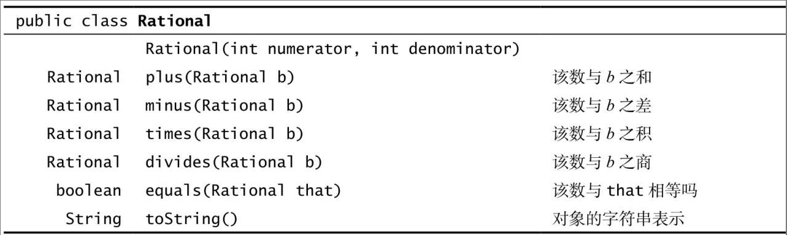

# 算法4 1.2数据抽象练习

## 1.2.1 编写一个Point2D的用例，从命令行接受一个整数N。在单位正方形中生成N个随机点，然后计算两点之间的最近距离

```java
import edu.princeton.cs.algs4.Interval1D;
import edu.princeton.cs.algs4.Interval2D;
import edu.princeton.cs.algs4.Point2D;

import java.awt.geom.Line2D;

public class Book_1_2_2_1 {

    public static void main(String[] args) {
        double xlo = Double.parseDouble(args[0]);
        double xhi = Double.parseDouble(args[1]);
        double ylo = Double.parseDouble(args[2]);
        double yhi = Double.parseDouble(args[3]);
        int t = Integer.parseInt(args[4]);

        Interval1D xInterval = new Interval1D(xlo, xhi);
        Interval1D yInterval = new Interval1D(ylo, yhi);
        Interval2D box = new Interval2D(xInterval, yInterval);
        box.draw();
        Counter c = new Counter("hits");
        for (int i = 0; i < t; i++) {
            double x = Math.random();
            double y = Math.random();
            Point2D p = new Point2D(x,y);
            if(box.contains(p)) c.increment();
            else p.draw();
        }

        System.out.println(c);
        System.out.println(box.area());
    }
}
```

## 1.2.2 编写一个Interval1D的用例，从命令行接受一个整数N。从标准输入中读取N个间隔（每个间隔由一对double值定义）并打印出所有相交的间隔对

```java
import edu.princeton.cs.algs4.Interval1D;
import edu.princeton.cs.algs4.StdIn;

public class Test1_2_2 {

    public static void main(String[] args) {
        int n = Integer.parseInt(args[0]);
        Interval1D[] interval1DS = new Interval1D[n];
        for(int i = 0; i < n; i++)
        {
            double x= StdIn.readDouble();
            double y= StdIn.readDouble();
            interval1DS[i] = new Interval1D(Math.min(x, y), Math.max(x, y));
            if(i > 0)
                for (int j = 0; j < i; j++)
                    if(interval1DS[j].intersects(interval1DS[i]))
                        System.out.println(interval1DS[j] + " intersects " + interval1DS[i]);
        }
    }
}
```

```c
#include <stdio.h>
#include <stdlib.h>
#include "..\..\lib\interval1D.h"

int main(int argc, char * argv[])
{
    if(argc < 2)
    {
        fprintf(stderr,"Usage: %s integer(n)\n",argv[0]);
        exit(EXIT_FAILURE);
    }

    int n = atoi(argv[1]);
    double x,y;
    char str[100];
    Interval1D lis[n];
    for(int i = 0; i < n; i++)
    {
        while(!scanf("%lf%lf",&x,&y) == 2)
            continue;
        initInterval1D(&lis[i],x > y ? y : x,x > y ? x : y);
        if(i > 0)
            for(int j = 0; j < i; j++)
                if(intersects(&lis[j],&lis[i]))
                {
                    interval1DtoString(&lis[j],str,100);
                    printf("%s intersects ",str);
                    interval1DtoString(&lis[i],str,100);
                    printf("%s\n",str);
                }
    }
    return 0;
}
```

## 1.2.3 编写一个Interval2D的用例，从命令行接受参数N、min和max。生成N个随机的2D间隔，其宽和高均匀地分布在单位正方形中的min和max之间。用StdDraw画出它们并打印出相交的间隔对的数量以及有包含关系的间隔对数量

```java
import edu.princeton.cs.algs4.*;

public class Test1_2_3 {

    public static Interval1D ranByMinToMax(double min, double max)
    {
        double lo,hi;
        lo = StdRandom.uniformDouble(0,1 - min);
        hi = StdRandom.uniformDouble(lo + min, lo + max > 1 ? 1 : lo + max);
        return new Interval1D(lo,hi);
    }

    public static boolean contains(Interval2D a,Interval1D ix,Interval1D iy)
    {
        return a.contains(new Point2D(ix.min(),iy.min()))
                && a.contains(new Point2D(ix.min(),iy.max()))
                && a.contains(new Point2D(ix.max(),iy.min()))
                && a.contains(new Point2D(ix.max(),iy.max()));
    }

    public static void main(String[] args) {
        int n = Integer.parseInt(args[0]);
        double min = Double.parseDouble(args[1]);
        double max = Double.parseDouble(args[2]);
        Interval2D box = new Interval2D(new Interval1D(0, 1), new Interval1D(0, 1));
        box.draw();

        StdDraw.setPenColor(StdDraw.BLUE);
        Interval2D[] list = new Interval2D[n];
        int  intersectsCnt = 0;
        int containsCnt = 0;
        for (int i = 0; i < n; i++) {
            Interval1D ix = ranByMinToMax(min,max);
            Interval1D iy = ranByMinToMax(min,max);
            list[i] = new Interval2D(ix,iy);
            list[i].draw();
            if(i > 0)
                for (int j = 0; j < i; j++) {
                    if (list[j].intersects(list[i]))
                        intersectsCnt++;
                    if(contains(list[j],ix,iy))
                        containsCnt++;
                }
        }
        System.out.printf("The intersects Interval2D count is %d\n",intersectsCnt);
        System.out.printf("The contains Interval2D count is %d\n",containsCnt);
    }
}
```

## 1.2.4 以下这段代码会打印出什么

```java
String string1 = "hello";
String string2 = string1;
string1 = "world";
StdOut.println(string1);
StdOut.println(string2);
```

```java
world
hello
```

## 1.2.5 以下这段代码会打印出什么

```java
String s = "Hello World";
s.toUpperCase();
s.substring(6, 11);
StdOut.println(s);
```

```java
Hello World
```

答："Hello World"。String对象是不可变的——所有字符串方法都会返回一个新的String对象（但它们不会改变参数对象的值）。这段代码忽略了返回的对象并直接打印了原字符串。要打印出"WORLD"，请用s = s.toUpperCase()和s =s.substring(6, 11)。

## 1.2.6 如果字符串s中的字符循环移动任意位置之后能够得到另一个字符串t，那么s就被称为t的回环变位（circular rotation）。例如，ACTGACG就是TGACGAC的一个回环变位，反之亦然。判定这个条件在基因组序列的研究中是很重要的。编写一个程序检查两个给定的字符串s和t是否互为回环变位。提示：答案只需要一行用到indexOf()、length()和字符串连接的代码

```c
#include <stdio.h>
#include <stdlib.h>
#include <string.h>

char * s_gets(char * st,int n);
int circulari_rotation(const char * a,const char * b);

int main(void)
{
    char a[1024];
    char b[1024];
    while(s_gets(a,1024) != NULL && a[0] != '\0' && s_gets(b,1024) != NULL && b[0] != '\0')
        if(circulari_rotation(a,b))
            printf("%s and %s is circulari totation\n",a,b);
        else
            printf("%s and %s not is circulari totation\n",a,b);
    return 0;
}

char * s_gets(char * st,int n)
{
    char * ret_val;
    char * find;

    ret_val = fgets(st, n, stdin);
    if(ret_val)
    {
        find = strchr(st,'\n');
        if(find)
            *find = '\0';
        else 
            while(getchar() != '\n')
                continue;
    }
    return ret_val;
}

int circulari_rotation(const char * a,const char * b)
{
    size_t alen = strlen(a);
    size_t blen = strlen(b);
    if(alen != blen)
        return 0;
    size_t strlen = alen + blen;
    char * str = malloc( (strlen + 1 ) * sizeof(char) );
    strncpy(str,b,strlen);
    strncat(str,b,blen);
    return strstr(str,a) != NULL;
}
```

```java
public class Test1_2_6 {

    public static boolean circular_rotation(String a, String b)
    {
        return a.length() == b.length() && b.concat(b).contains(a);
    }

    public static void main(String[] args) {
        if(circular_rotation(args[0],args[1]))
            System.out.println("yes");
        else
            System.out.println("no");
    }
}
```

## 1.2.7 以下递归函数的返回值是什么

```java
public static String mystery(String s)
{
    int N = s.length();
    if (N <= 1) return s;
    String a = s.substring(0, N/2);
    String b = s.substring(N/2, N);
    return mystery(b) + mystery(a);
}
```

s字符串的倒序

## 1.2.8 设a[ ]和b[ ]均为长数百万的整形数组。以下代码的作用是什么？有效吗

答：这段代码会将它们交换。它的效率不可能再高了，因为它复制的是引用而不需要复制数百万个元素。

## 1.2.9 修改BinarySearch（请见1.1.10.1节中的二分查找代码），使用Counter统计在有查找中被检查的键的总数并在查找全部结束后打印该值。提示：在main()中创建一个Counter对象并将它作为参数传递给rank

```c
#include <stdio.h>
#include <stdlib.h>
#include "..\..\lib\in.h"
#include "book\counter.h"

int rank(int key, int * a,int length,Counter * c);
int intcompar(const void * a,const void *b);

int main(int argc,char * argv[])
{
    int key;
    int_arr whitelist;
    readInts(&whitelist,argv[1]);
    qsort(whitelist.data,whitelist.length,sizeof(int),intcompar);

    Counter c;
    char str[100];
    while(scanf("%d",&key) == 1)
    {
        initCounter(&c,"count");
        if(rank(key,whitelist.data,whitelist.length,&c) < 0)
        {
            counterString(&c,str,100);
            printf("%d\n%s\n",key,str);
        }
    }
    free(whitelist.data);
    return 0;
}

int rank(int key, int * a,int length,Counter * c)
{
    int lo = 0;
    int hi = length -1;
    while(lo <= hi)
    {
        int mid = lo + (hi - lo) / 2;
        increment(c);
        if(key < a[mid]) hi = mid - 1;
        else if (key > a[mid]) lo = mid + 1;
        else return mid;
    }
    return -1;
}

int intcompar(const void * a,const void * b)
{
    int * ia = (int *) a;
    int * ib = (int *) b;
    return *ia - *ib;
}
```

```java
import edu.princeton.cs.algs4.Counter;
import edu.princeton.cs.algs4.In;
import edu.princeton.cs.algs4.StdIn;
import edu.princeton.cs.algs4.StdOut;

import java.util.Arrays;

public class Test1_2_9 {

    public static int rank(int key, int[] a,Counter c)
    {  // 数组必须是有序的
        int lo  = 0;
        int hi = a.length -1;
        while (lo <= hi)
        {  // 被查找的键要么不存在，要么必然存在于a[lo..hi]之中
            c.increment();
            int mid = lo + (hi - lo) / 2;
            if       (key < a[mid]) hi = mid -1;
            else if (key > a[mid]) lo = mid + 1;
            else                     return mid;
        }
        return -1;
    }
    public static void main(String[] args)
    {
        int[] whitelist = In.readInts(args[0]);
        Arrays.sort(whitelist);
        while (! StdIn.isEmpty())
        {  // 读取键值，如果不存在于白名单中则将其打印
            int key = StdIn.readInt();
            Counter counter = new Counter("key"+ key);
            if (rank(key, whitelist,counter) >= 0)
                StdOut.println(key);
            System.out.println(counter);
        }
    }
}
```

## 1.2.10 编写一个类VisualCounter，支持加一和减一操作。它的构造函数接受两个参数N和max，其中N指定了操作的最大次数，max指定了计数器的最大绝对值。作为副作用，用图像显示每次计数器变化后的值

VisualCounter类:

```java
import edu.princeton.cs.algs4.StdDraw;
import edu.princeton.cs.algs4.StdRandom;

public class VisualCounter {

    private int count;

    private int value;

    public VisualCounter(int n, int max) {
        StdDraw.setXscale(0,n);
        StdDraw.setYscale(-max,max);
        StdDraw.setPenRadius(.005);
    }

    public void increment()
    {
        count++;
        value++;
        StdDraw.point(count,value);
    }

    public void decrease()
    {
        count++;
        value--;
        StdDraw.point(count,value);
    }

    public int tally()
    {return value;}

    @Override
    public String toString() {
        return "[" + count+", "+value+"]";
    }
}
```

测试用例:

```java
import edu.princeton.cs.algs4.StdRandom;

public class TestVisualCounter {

    public static void main(String[] args) {
        int n = Integer.parseInt(args[0]);
        VisualCounter vc = new VisualCounter(n, n);
        StdRandom.setSeed(System.currentTimeMillis());
        for (int i = 0; i < n; i++) {
            if(StdRandom.uniformDouble() > 0.3)
                vc.decrease();
            else
                vc.increment();
        }
        System.out.println(vc.tally());
        System.out.println(vc);
    }
}
```

## 1.2.11 根据Date的API实现一个SmartDate类型，在日期非法时抛出一个异常

```c
#ifndef SMARTDATE_H
#define SMARTDATE_H

typedef struct smartDate
{
    int value;
} SmartDate;

void initDate(SmartDate * sd,int y,int m,int d);

int month(SmartDate * sd);

int day(SmartDate * sd);

int year(SmartDate * sd);

void smartDateToString(SmartDate * sd,char * str,size_t n);

#endif
```

```c
#include <stdio.h>
#include <stdlib.h>
#include "SmartDate.h"

static int monthDay[13] = { 0, 31, 28, 31, 30, 31, 30, 31, 31, 30, 31, 30, 31}

int isLeapYear(int y);

void initDate(SmartDate * sd,int y,int m,int d)
{
    if(m < 1 || m > 12)
    {
        fprintf(stderr,"the month %d not in the 1 to 12 range",m);
        exit(EXIT_FAILURE);
    }

    if(isLeapYear(y) && m == 2 && (d < 1 || d > 29))
    {
        fprintf(stderr,"the day %d not in the 1 to 29 range",m);
        exit(EXIT_FAILURE);
    }

    if(d < 1 || d > monthDay[m])
    {
        fprintf(stderr,"the day %d not in the 1 to %d range",m,monthDay[m]);
        exit(EXIT_FAILURE);
    }

    sd -> value = y * 512 + m * 32 + d;
}

int month(SmartDate * sd)
{
    return (sd->value / 32) % 16;
}

int day(SmartDate * sd)
{
    return sd->value % 32;
}

int year(SmartDate * sd)
{
    return sd->value / 512;
}

void smartDateToString(SmartDate * sd,char * str,size_t n)
{
    snprintf(str, n,"%d/%d/%d",month(sd),day(sd),year(sd));
}

int isLeapYear(int y)
{
    return (y % 4 == 0 && y % 100 != 0) || y % 400 == 0;
}
```

```java
import java.util.Objects;

public class SmartDate {

    private final int year;
    private final int month;
    private final int day;

    private static final int[] monthDay = {0,31,28,31,30,31,30,31,31,30,31,30,31};

    public static boolean isLeapYear(int y)
    {
        return ( y % 4 == 0 && y % 100 != 0) || y % 400 == 0;
    }

    public SmartDate(int m, int d, int y) {
        if(m < 1 || m > 12)
            throw new IllegalArgumentException("the month " + m + " not in the 1 to 12 range");

        if(isLeapYear(y) && m == 2 && (d < 1 || d > 29))
            throw new IllegalArgumentException("the day "+ d +" not in the 1 to 29 range");

        if(d < 1 || d > monthDay[m])
            throw new IllegalArgumentException("the day "+ d +" not in the 1 to " + monthDay[m] + " range");

        this.year = y;
        this.month = m;
        this.day = d;
    }
    public int month() {
        return month;
    }

    public int day() {
        return day;
    }

    public int year() {
        return year;
    }

    @Override
    public String toString() {
        return month() + "/" + day() +"/" +year();
    }

    @Override
    public boolean equals(Object o) {
        if (this == o) return true;
        if (o == null || getClass() != o.getClass()) return false;
        SmartDate basicDate = (SmartDate) o;
        return year == basicDate.year && month == basicDate.month && day == basicDate.day;
    }

    @Override
    public int hashCode() {
        return Objects.hash(year, month, day);
    }
}
```

## 1.2.12 为SmartDate添加一个方法dayOfTheWeek()，为日期中每周的日返回Monday、Tuesday、Wednesday、Thursday、Friday、Saturday或Sunday中的适当值。你可以假定时间是21世纪

```c
#define DEFULT_YEAR 2000

static int monthDay[13] = { 0, 31, 28, 31, 30, 31, 30, 31, 31, 30, 31, 30, 31}
static int day_of_weeks[6] = { 6, 7, 1, 2, 3, 4, 5}
static int day_of_weeks_r[6] = { 6, 5, 4, 3, 2, 1, 7}

int dayOfTheWeek(SmartDate * sd)
{
    int daysdiff = 0;
    if(year(sd) >= DEFULT_YEAR )
    {
        for(int i = DEFULT_YEAR; i < year(sd); i++) 
            daysdiff += isLeapYear(i) ? 366 : 365;
        for(int i = 1; i < month(sd); i++)
            daysdiff += isLeapYear(year(sd)) && i == 2 ? monthDay[i] + 1 : monthDay[i];
        daysdiff += day(sd);
        daysdiff -= 1;
        return day_of_weeks[daysdiff % 7];
    } else {
        for(int i = year(sd) + 1; i < DEFULT_YEAR; i++)
            daysdiff += isLeapYear(i) ? 366 : 365;
        for(int i = month(sd) + 1; i <= 12; i++)
            daysdiff += isLeapYear(year(sd)) && i == 2 ? monthDay[i] + 1 : monthDay[i];
        int i = month(sd);
        daysdiff += isLeapYear(year(sd)) && i == 2 ? monthDay[i] + 1 - day(sd) : monthDay[i] - day(sd);
        daysdiff++;
        return day_of_weeks_r[daysdiff % 7];
    }
}

int isLeapYear(int y)
{
    return (y % 4 == 0 && y % 100 != 0) || y % 400 == 0;
}
```

```java
    public int dayOfTheWeek()
    {
        int daysdiff = 0;
        if(year() >= 2000 )
        {
            for(int i = 2000; i < year(); i++)
                daysdiff += isLeapYear(i) ? 366 : 365;
            for(int i = 1; i < month(); i++)
                daysdiff += isLeapYear(year()) && i == 2 ? monthDay[i] + 1 : monthDay[i];
            daysdiff += day();
            daysdiff -= 1;
            return day_of_weeks[daysdiff % 7];
        } else {
            for(int i = year() + 1; i < 2000; i++)
                daysdiff += isLeapYear(i) ? 366 : 365;
            for(int i = month() + 1; i <= 12; i++)
                daysdiff += isLeapYear(year()) && i == 2 ? monthDay[i] + 1 : monthDay[i];
            daysdiff += isLeapYear(year()) && month() == 2 ? monthDay[month()] + 1 - day() : monthDay[month()] - day();
            daysdiff++;
            return day_of_weeks_r[daysdiff % 7];
        }
    }
```

## 1.2.13 用我们对Date的实现（请见表1.2.12）作为模板实现Transaction类型

```c
#include <stdio.h>
#include <stdlib.h>
#include "Transaction.h"

char * who(Transaction * t)
{
    return t->cust_name;
}

SmartDate * when(Transaction * t)
{
    return t->sd;
}

double amount(Transaction * t)
{
    return t->amount;
}

void transactionToString(Transation * t,char * str,size_t n)
{
    char s[100];
    smartDateToString(t->sd,s,100);
    snprintf(str,n,"%s, %s, %lf",t->cust_name,s,t->amount); 
}
```

## 1.2.14 用我们对Date中的equals()方法的实现（请见1.2.5.8节中的Date类代码框）作为模板，实现Transaction中的equals()方法

```java
import java.util.Objects;

public class Transaction {

    private String custName;

    private SmartDate transactionDate;

    private double amount;

    public Transaction(String who,SmartDate when,double amount) {
        custName = who;
        transactionDate = new SmartDate(when.day(),when.month(),when.year());
        this.amount = amount;
    }

    public String who()
    {
        return custName;
    }

    public SmartDate when()
    {
        return transactionDate = new SmartDate(transactionDate.day(),transactionDate.month(),transactionDate.year());
    }

    public double amount()
    {
        return amount;
    }

    @Override
    public String toString() {
       return "[" + custName + ", " + transactionDate + ", "+amount+"]";
    }

    @Override
    public boolean equals(Object o) {
        if (this == o) return true;
        if (o == null || getClass() != o.getClass()) return false;
        Transaction that = (Transaction) o;
        return Double.compare(amount, that.amount) == 0 && Objects.equals(custName, that.custName) && Objects.equals(transactionDate, that.transactionDate);
    }

    @Override
    public int hashCode() {
        return Objects.hash(custName, transactionDate, amount);
    }
}
```

## 1.2.15 文件输入。基于String的split()方法实现In中的静态方法readInts

```java
public static int[] readInts(String name)
{
    In in = new In(name);
    String input = in.readAll();
    String[] words = input.split("\\s+");
    int[] ints = new int[words.length];
    for(int i = 0; i ＜ word.length; i++)
      ints[i] = Integer.parseInt(words[i]);
    return ints;
}
```

我们会在1.3节中学习另一个不同的实现（请见1.3.1.5节）。

## 1.2.16 有理数。为有理数实现一个不可变数据类型Rational，支持加减乘除操作



无需测试溢出（请见练习1.2.17），只需使用两个long型实例变量表示分子和分母来控制溢出的可能性。使用欧几里得算法来保证分子和分母没有公因子。编写一个测试用例检测你实现的所有方法。

```c
#ifndef RATIONAL_H
#define RATIONAL_H

typedef struct rational
{
    long numerator;
    long denominator;
} Rational;

void initRational(Rational * a,int numerator, int denominator);

Rational * plus(Rational * r, const Rational * a, const Rational * b); 

Rational * minus(Rational * r, const Rational * a, const Rational * b); 

Rational * times(Rational * r, const Rational * a, const Rational * b); 

Rational * divides(Rational * r, const Rational * a, const Rational * b); 

int rationalEquals(const Rational * a,const Rational * b);

char * rationalToString(const Rational * a, char * str, size_t n);

#endif
```

```c
#include <stdio.h>
#include <stdlib.h>
#include "Rational.h"

long gcd_sign(long p, long q);

long gcd(long p,long q);

void initRational(Rational * a,int numerator, int denominator)
{
    if(denominator == 0)
    {
        fprintf(stderr,"the denominator : %d not zero",denominator);
        exit(EXIT_FAILURE);
    }
    long gcd_num;
    gcd_num = gcd_sign(numerator,denominator);
    a->numerator = numerator / gcd_num;
    a->denominator = denominator / gcd_num;
}

Rational * plus(Rational * r, const Rational * a, const Rational * b)
{
    long gcd_num,numerator,denominator;

    numerator = a->numerator * b->denominator + b->numerator * a->denominator;
    denominator = a->denominator * b->denominator;

    gcd_num = gcd_sign(numerator,denominator);
    r->numerator = numerator / gcd_num;
    r->denominator = denominator / gcd_num;
    return r;
}

Rational * minus(Rational * r, const Rational * a, const Rational * b)
{
    long gcd_num,numerator,denominator;

    numerator = a->numerator * b->denominator - b->numerator * a->denominator;
    denominator = a->denominator * b->denominator;

    gcd_num = gcd_sign(numerator,denominator);
    r->numerator = numerator / gcd_num;
    r->denominator = denominator / gcd_num;
    return r;
}

Rational * times(Rational * r, const Rational * a, const Rational * b)
{
    long gcd_num,numerator,denominator;

    numerator = a->numerator * b->numerator;
    denominator = a->denominator * b->denominator;

    gcd_num = gcd_sign(numerator,denominator);
    r->numerator = numerator / gcd_num;
    r->denominator = denominator / gcd_num;
    return r;
}

Rational * divides(Rational * r, const Rational * a, const Rational * b)
{
    long gcd_num,numerator,denominator;

    numerator = a->numerator * b->denominator;
    denominator = a->denominator * b->numerator;

    gcd_num = gcd_sign(numerator,denominator);
    r->numerator = numerator / gcd_num;
    r->denominator = denominator / gcd_num;
    return r;
}

int rationalEquals(const Rational * a,const Rational * b)
{
    return ( (a->numerator / b->numerator) / (a->denominator / b->denominator) ) == 1;
}

char * rationalToString(const Rational * a, char * str, size_t n)
{
    snprintf(str,n,"%ld/%ld",a->numerator,a->denominator);
    return str;
}

long gcd(long p,long q)
{
    if(q == 0) return p;
    long r = p % q;
    return gcd(q,r);
}

long gcd_sign(long p, long q)
{
    long result;
    result = gcd(p > 0 ? p : -p, q > 0 ? q : -q);
    if( p < 0 && q < 0)
        return -result;
    else
        return result;
}
```
