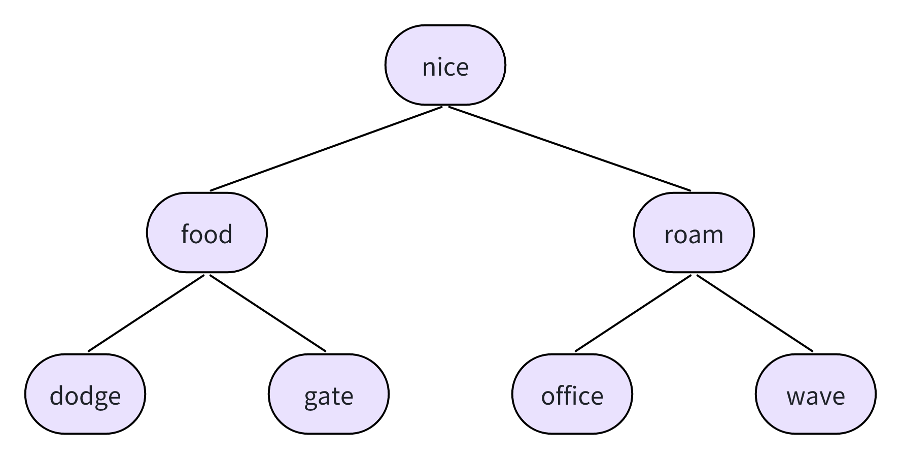
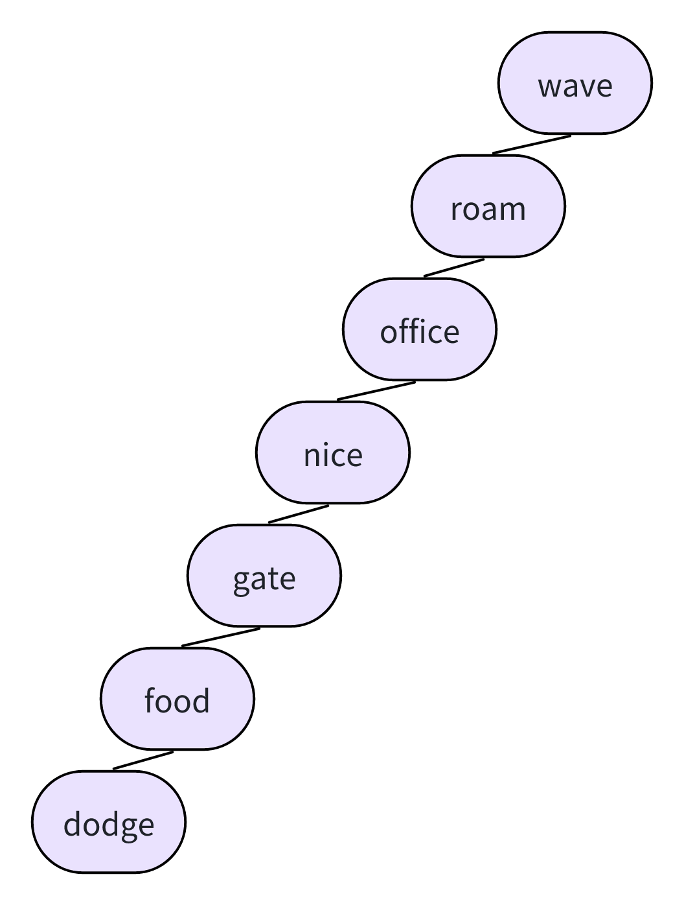
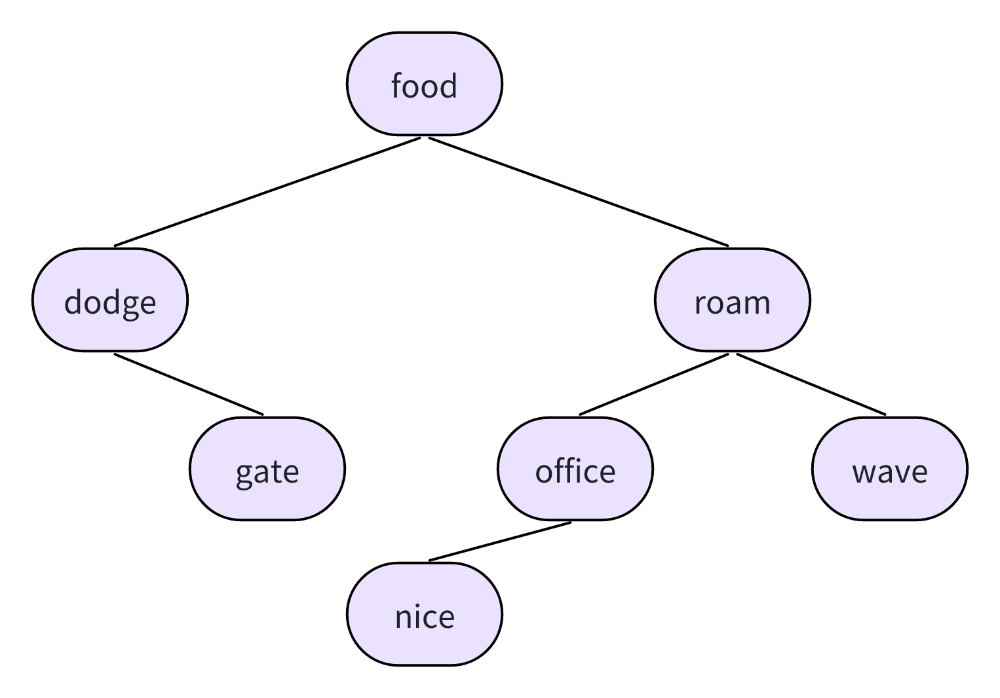
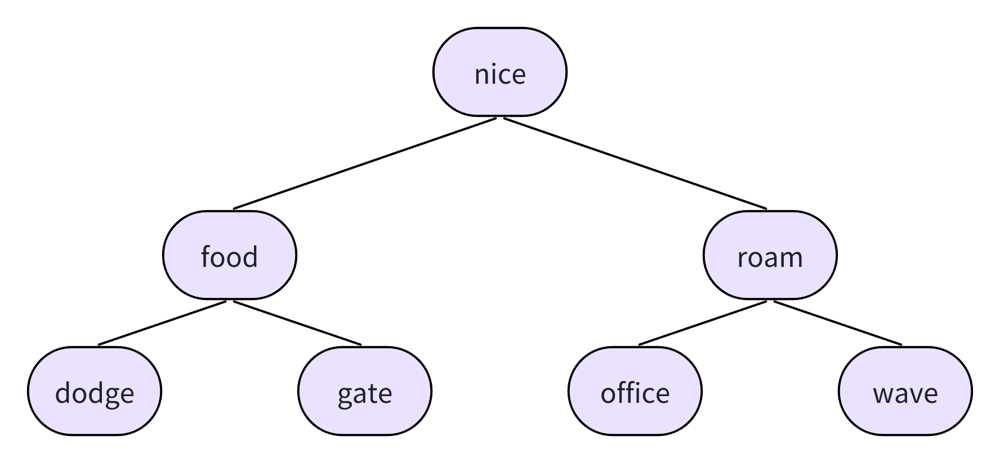
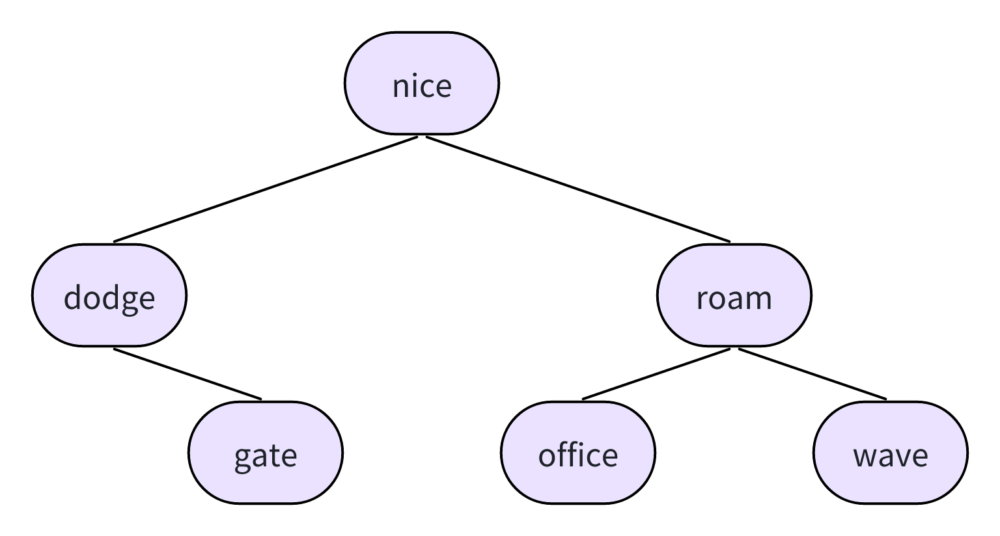
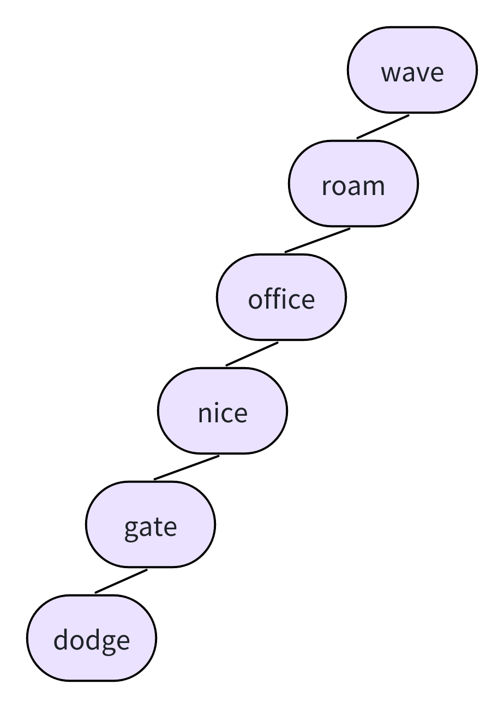
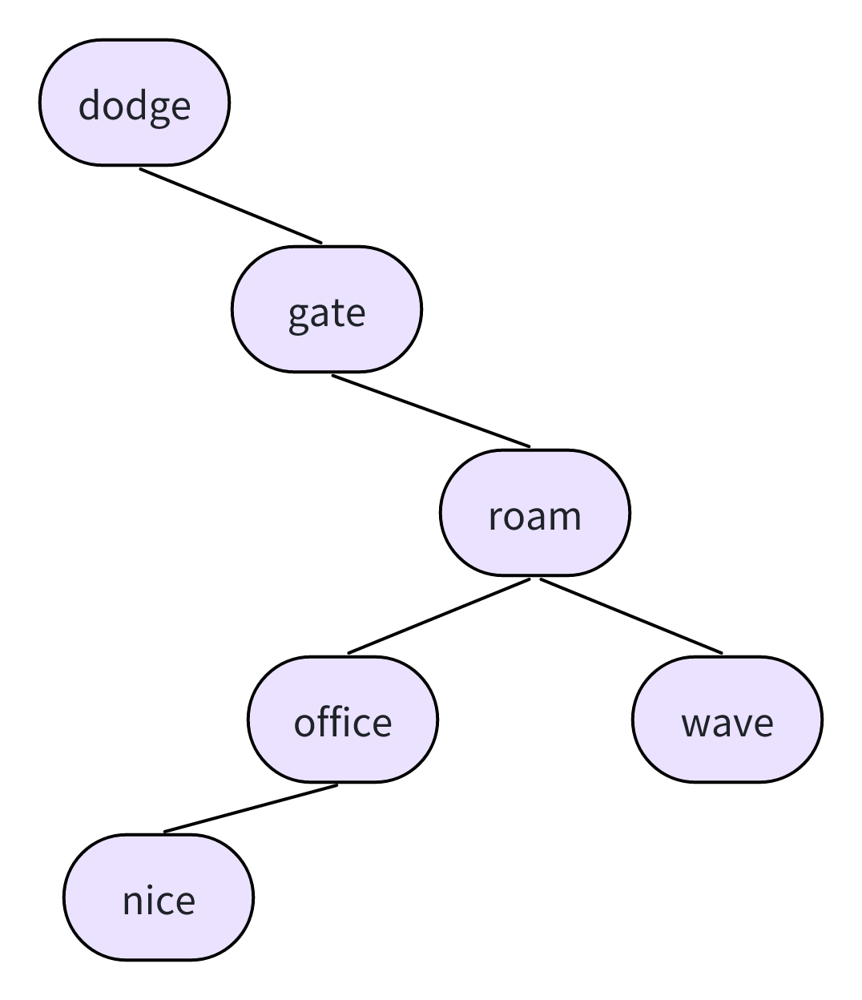

# 17.11　复习题

## 1．定义一种数据类型涉及哪些内容

定义一种数据类型包括确定如何存储数据，以及设计管理该数据的一系列函数。

## 2．为什么程序清单17.2只能沿一个方向遍历链表？如何修改struct film定义才能沿两个方向遍历链表

因为每个结构包含下一个结构的地址，但是不包含上一个结构的地址，所以这个链表只能沿着一个方向遍历。可以修改结构，在结构中包含两个指针，一个指向上一个结构，一个指向下一个结构。当然，程序也要添加代码，在每次新增结构时为这些指针赋正确的地址。

## 3．什么是ADT

ADT是抽象数据类型，是对一种类型属性集和可以对该类型进行的操作的正式定义。ADT应该用一般语言表示，而不是用某种特殊的计算机语言，而且不应该包含实现细节。

## 4．QueueIsEmpty()函数接受一个指向queue结构的指针作为参数，但是也可以将其编写成接受一个queue结构作为参数。这两种方式各有什么优缺点

- 直接传递变量的优点：该函数查看一个队列，但是不改变其中的内容。直接传递队列变量，意味着该函数使用的是原始队列的副本，这保证了该函数不会更改原始的数据。直接传递变量时，不需要使用地址运算符或指针。
- 直接传递变量的缺点：程序必须分配足够的空间存储整个变量，然后拷贝原始数据的信息。如果变量是一个大型结构，用这种方法将花费大量的时间和内存空间。
- 传递变量地址的优点：如果待传递的变量是大型结构，那么传递变量的地址和访问原始数据会更快，所需的内存空间更少。
- 传递变量地址的缺点：必须记得使用地址运算符或指针。在K&R C中，函数可能会不小心改变原始数据，但是用ANSI C中的const限定符可以解决这个问题。

## 5．栈（stack）是链表系列的另一种数据形式。在栈中，只能在链表的一端添加和删除项，项被“压入”栈和“弹出”栈。因此，栈是一种LIFO（即后进先出last in,first out）结构

- a．设计一个栈ADT
  - **类型名:**
    - 栈
  - **类型属性:**
    - 可以存储有序项
  - **类型操作:**
    - 初始化栈为空
    - 确定栈是否为空
    - 确定栈是否已满
    - 从栈顶添加项(压入项)
    - 从栈顶弹出项(弹出项)

- b．为栈设计一个C编程接口，例如stack.h头文件

```c
/* stack.h –– 栈的接口 */
#include <stdbool.h>
/* 在这里插入 Item 类型 */
/* 例如： typedef int Item; */

#define MAXSTACK 100

typedef struct stack
{
　　 Item items[MAXSTACK];　/* 存储信息        */
　　 int top;　　　　        /* 第1个空位的索引 */
} Stack;

/* 操作：　　　初始化栈　　　　　　　　　　　　　　　　　　　　　*/
/* 前提条件：　ps 指向一个栈　　　　　　　　　　　　　　　　　　 */
/* 后置条件：　该栈被初始化为空　　　　　　　　　　　　　　　　　*/
void InitializeStack(Stack * ps);

/* 操作：　　　检查栈是否已满　　　　　　　　　　　　　　　　　　*/
/* 前提条件：　ps 指向之前已被初始化的栈　　　　　　　　　　　　*/
/* 后置条件：　如果栈已满，该函数返回true；否则，返回false　　 */
bool FullStack(const Stack * ps);

/* 操作：　　　检查栈是否为空　　　　　　　　　　　　　　　　　　*/
/* 前提条件：　ps 指向之前已被初始化的栈　　　　　　　　　　　　*/
/* 后置条件：　如果栈为空，该函数返回true；否则，返回false　　 */
bool EmptyStack(const Stack *ps);

/* 操作：　　　把项压入栈顶　　　　　　　　　　　　　　　　　　　*/
/* 前提条件：　ps 指向之前已被初始化的栈　　　　　　　　　　　　*/
/*　　　　　　 item 是待压入栈顶的项　　　　　　　　　　　　　　*/
/* 后置条件：　如果栈不满，把 item 放在栈顶，该函数返回ture；　*/
/*　　　　　　 否则，栈不变，该函数返回 false　　　　　　　　　 */
bool Push(Item item, Stack * ps);

/* 操作：　　　从栈顶删除项　　　　　　　　　　　　　　　　　　　*/
/* 前提条件：　ps 指向之前已被初始化的栈　　　　　　　　　　　　*/
/* 后置条件：　如果栈不为空，把栈顶的item拷贝到*pitem，　　　　*/
/*　　　删除栈顶的item，该函数返回ture；　　　　　　　　　　　　*/
/*　　　如果该操作后栈中没有项，则重置该栈为空。　　　　　　　　*/
/*　　　如果删除操作之前栈为空，栈不变，该函数返回false　　　 　*/
bool Pop(Item *pitem, Stack * ps);
```

## 6．在一个含有3个项的分类列表中，判断一个特定项是否在该列表中，用顺序查找和二叉查找方法分别需要最多多少次？当列表中有1023个项时分别是多少次？65535个项是分别是多少次

|项|顺序查找|二分查找|
|---|---|---|
|3|3|2|
|1023|1023|10|
|65535|65535|16|

## 7．假设一个程序用本章介绍的算法构造了一个存储单词的二叉查找树。假设根据下面所列的顺序输入单词，请画出每种情况的树

- a．nice food roam dodge gate office wave
  - 
- b．wave roam office nice gate food dodge
  - 
- c．food dodge roam wave office gate nice
  - 
- d．nice roam office food wave gate dodge
  - 

## 8．考虑复习题7构造的二叉树，根据本章的算法，删除单词food之后，各树是什么样子

- a．nice food roam dodge gate office wave
  - 
- b．wave roam office nice gate food dodge
  - 
- c．food dodge roam wave office gate nice
  - 
- d．nice roam office food wave gate dodge
  - 
